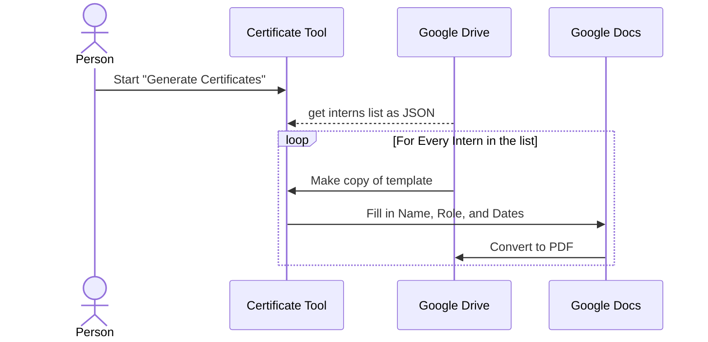

```mermaid
sequenceDiagram
    actor User as Person
    participant Script as Certificate Tool
    participant Drive as Google Drive
    participant Doc as Google Docs

    User->>Script: Start "Generate Certificates" 
    Drive-->>Script: get interns list as JSON

    loop For Every Intern in the list
        Drive->>Script: Make copy of template
        Script->>Doc: Fill in Name, Role, and Dates
        Doc->>Drive: Convert to PDF
    end
```
